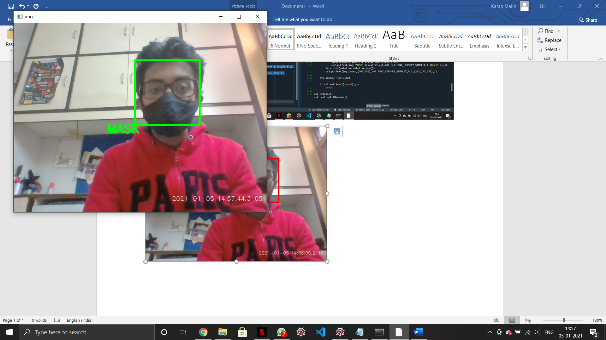
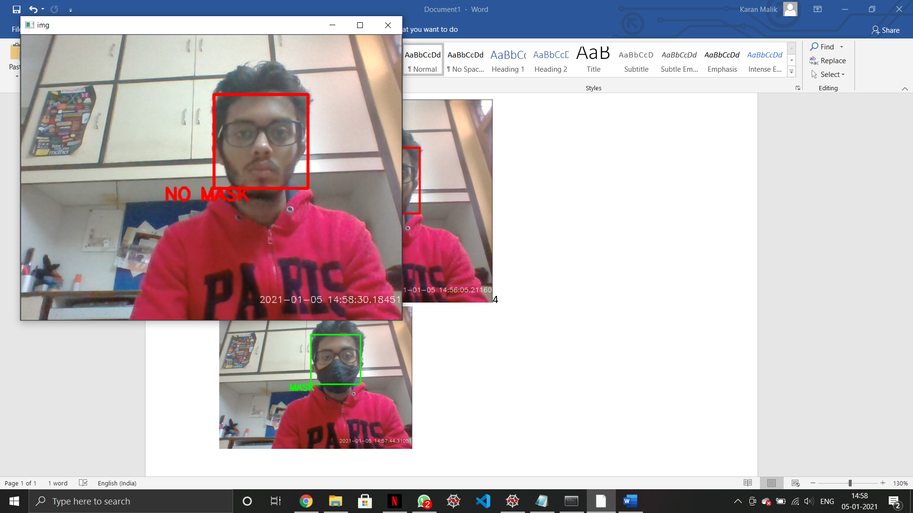

# Face-Mask Detector
Real time face-mask detection using Deep Learning and OpenCV

## About Project
This project uses a Deep Neural Network, more specifically a Convolutional Neural Network, to differentiate between images of people with and without masks. The CNN manages to get 
an accuracy of **98.2% on the training set** and **97.3% on the test set**. Then the stored weights of this CNN are used to classify as mask or no mask, in real time, using OpenCV.
With the webcam capturing the video, the frames are preprocessed and and fed to the model to accomplish this task. The model works efficiently with no apparent lag time between
wearing/removing mask and display of prediction.

#### The model is capable of predicting multiple faces with or without masks at the same time

## Working 

### With Mask



### No Mask




## Dataset

The data used can be downloaded through this [link](https://data-flair.training/blogs/download-face-mask-data/) or can be downloaded from this repository as well (folders 'test' and 
'train'). There are 1314 training images and 194 test images divided into two catgories, with and without mask.

## How to Use

To use this project on your system, follow these steps:

1.Clone this repository onto your system by typing the following command on your Command Prompt:

```
git clone https://github.com/Karan-Malik/FaceMaskDetector.git
```
followed by:

```
cd FaceMaskDetector
```

2. Download all libaries using::
```
pip install -r requirements.txt
```

3. Run facemask.py by typing the following command on your Command Prompt:
```
python facemask.py
```

#### The Project is now ready to use !!


